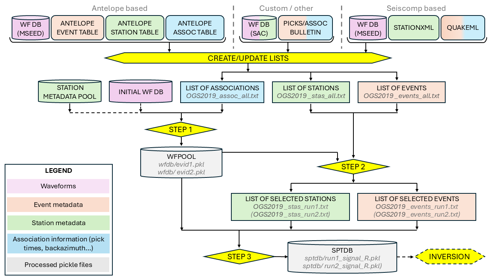

# spectral_modelling

README - spectral inversion code for application on NE Italy data

Package: spectral_modelling

Branch: main-obspy

The spectral_modelling package provides a set of tools to perform parametric spectral inversion on seismic Fourier Amplitude Spectra (FAS).

It consists of two halves: the first one handles the creation of a spectral database starting from raw data (seismic records, station metadata, event information), the second one actually performs the parametric inversion.

Warning: This is still **WORK IN PROGRESS**! This is currently a basic implementation of the whole inversion procedure and is tailored to the NorthEast Italy area.

All codes were written by Laura Cataldi. 

## Installation

To install spectral_modelling in developer mode, first create a python environment, e.g.:\
```conda create -n specmodconda python=3.10```\
```conda activate specmodconda```

or

```python3.10 -m venv /path/to//specmodconda```\
```source /path/to/specmodconda/bin/activate```

Then install in editable mode from the fetched repository, e.g.:

```pip install  --use-pep517 --editable .```

or

```python -m pip install --use-pep517 --editable .```

Please remember that the code is tested only for python=3.9 and python=3.10.

## First part: preparing the spectral dataset



The first thing to do is to prepare the actual spectral dataset that will be used for inversion. To do so, we have to optimize the pre-processing code for the case at hand. All of the following steps refer to the code inside the folder *db_create*.

Remember: an example of running all the *db_create* steps is provided in *bin/run_three_steps.py*

Outline of the code workflow for this section:
### 0.	STEP 0 – db_create/parsers.py 
> corresponding to element **CREATE/UPDATE** LISTS in the graph 

Before anything else, we need to parse the actual dataset we want to work with, to produce csv lists of events, stations and associations (picks). 
At the moment, the code only supports the following formats:
* for event metadata: csv Bulletin files, quakeml files 
* for station metadata: stationxml, SAC
* for association information: csv Bulletin files, quakeml files 

The parsers produce csv tables of all available events/stations/associations with the following syntax:

for stations:
```
net;sta;slat;slon;selev
OX;ACOM;46.5479;13.5149;1715.0
```

for events:
```
evid;evid_inst;etime;elat;elon;edepth;ml;mw
1;969;2019-06-14T13:57:24.040000Z;46.3955;12.9933;8.13;3.85;3.72
```

for associations:
```
evid;evid_inst;sta;phase;picktime;baz;takeoff;hypodist
1;969;ACOM;P;2019-06-14T13:57:31.910000Z;247.27;100.42;44.248
```

A unique database name can be set in the configuration file so that the output is clearly recognizable, e.g. *OSG2019* for the example dataset. Output files will be thus named *OSG2019_assoc_all.txt*, *OSG2019_events_all.txt*, *OSG2019_stas_all.txt*.

### 1.	STEP 1 – db_create/step1_create_wfpool.py
> this section still has to be improved in terms of performance

This step read the input csv tables containing all the available associations and use them to extract waveforms from the corresponding initial waveform database.

Recognized formats for the database are either SAC files or miniseed files; the SAC files must be already corrected for instrumental correction, while mseed files can be corrected on-the-go if the response information is provided.

The output waveform pool (**WFPOOL** in the graph; defined in *config.WFDBPATH*) consists of a set of pickle objects, one for each event, containing all available waveforms for that event (regardless of their quality, at this step). For each evid, the output pickle file contains all the signal and noise waveform available for that event. For each evid, all available recordings are rotated to the radial/transverse components, which are then cut into S-signal and pre-P noise windows using pick times from the association table. Then all waveforms associated to the event are stored in a dictionary containing a Stream each for R component of signal, T component of signal, R component of noise and T component of noise, as well as a list of signal-to-noise (SNR) scores for both R and T cases, a list of the corresponding station codes, and a list of the corresponding hypocentral distances.

### 2.	STEP 2 – db_create/step2_filter_run.py

In this step we apply some constraints on our initial databases of waveforms, events and stations. First the WFPOOL is parsed and an initial filter is applied based on SNR score and on hypocentral distance (thresholds are set in *config.SNRMIN*, *config.MIN_HYPODIST*, *config.MAX_HYPODIST*). Then a recursive filter is applied to ensure that each event has a minimum of associated recordings (*nstassoc*; threshold set in *config.MIN_STAS*) and each station has a minimum of associated recorded events (*nevassoc*; threshold set in *config.MIN_EVS*), for inversion stability. New, filtered databases of events and stations to be used for inversion are output as csv files, following a similar syntax as the initial ones:

for stations: 
```
net;sta;slat;slon;nevassocc
OX;BAD;46.234;13.2438;12
```

for events:
```
evid;evid_inst;etime;elat;elon;edepth;ml;mag;nstassoc;stassoc
1;969;2019-06-14T13:57:24.040000Z;46.3955;12.9933;8.13;3.85;3.72;12;['BAD', 'BOO', 'BUA', 'CLUD', 'FVI', 'GEPF', 'MLN', 'MPRI', 'PLRO', 'PTCC', 'VINO', 'ZOU2']
```

where stassoc is the list of the actual stations whose recording of the event can be used for the inversion. A runname can be set in the configuration file (*config.RUNNAME*) to distinguish between different constraint choices; a corresponding README file is generated with the recap of used constraints, so that the run name doesn't have to be extremely informative. 
Output file will be named *OGS2019_stas_run1.txt*, *OGS2019_events_run1.txt*, *README_OGS2019_run1.txt*. 


### 3.	STEP 3 – db_create/step3_save_sptdb.py
> this section still has to be improved in terms of performance

In this step we select only those waveforms in WFPOOL which are identified as usable for inversion by the filtered event and station lists produced by Step 2. For each waveform we calculate the Fourier amplitude spectrum and store it in a *utils.Spectrum()* class object, which contains also information on orid, station, distance, etc. The resulting Spectrum() items are grouped into four lists, one for each of the R-component signal, T-component signal, R-component noise and T-component noise. Each list is then saved as a pickle object, composing the output SPTDB (spectrum database; defined in *config.SPTDBPATH*) which will be the input to the inversion tool. We can generate plots for all the obtained spectra by using the *visualization_tools/plot_sptdb.py* utility.

## Second part: parmetric inversion

Once we have the spectral database ready, it's time to set up the parametric inversion.

Keep in mind that the code uses the model described in Cataldi et al. 2022, so you will have to adjust some features in order to use a different modelling. Also the inversion strategy is almost the same as in the article: you first perform the inversion on the spectral db without modelling the frequency-dependent site amplification functions, which are later calculated from the inversion residuals. Your final model will be composed by both the 'base' forward model and the frequency-dependent site contribution.

You can find an example of the full inversion procedure in bin/call_inversion.py, where the function call_inv_modules() is defined. First, you generate the synthetic parameter files if needed (if *calc_synth*=True). Then the function calls the inversion procedures with all the given options, and optionally plots the resulting FAS modelled curves compared to the observed smoothed FAS (if *plots*=True).

The core utilities for spectral modelling are in the *model_and_invert* folder. 
Here are the main features:

1.	The base element of this step will be the ***Params()*** class, defined in *utils/myClass.py*. This class is used to store all the spectral parameters; at the moment the following features are defined:
-	**alpha**: seismic_moment ln(M_0) [cm^2 * kg^2 / s^2]
-	**beta**: corner_frequency  [Hz]
-	**gamma**: exponents of geometrical_spreading function [adimensional]
-	**delta**: quality_factor Q_0 [adimensional] (if Q_alpha is not used)
-	**site_fi**: amplitude_correction ln(A) [adimensional]
-	**site_k**: k attenuation factor [s]
-	**eps_source**: uncertainty on source contribution
-	**eps_path**: uncertainty on path contribution
-	**eps_site**: uncertainty on site contribution

Please note that the uncertainty parameters are still experimental; I advise you to constrain them to zero and not use them.
Each parameter has an associated 'vary' value which equals 0 if the parameter will have to be minimized in the inversion and 1 if it has to be kept fixed at the starting value. You can also associate a range of values to each parameters using the *min* and *max* values; this is the range that will be explored by the inversion.

REMEMBER: if you plan to change the model, you will have to redefine the features here, as well as in the modelling utility and in the jacobian utility (more on this later). Also note that most functions use a flattened version of the parameter array, which can be checked by calling the *pars* feature of your *Params()* instance.

2.	***create_synth_pars.py***: this module allows you to create a “synthetic” set of spectral parameters which will be used also as starting point for the inversion minimization. For this reason, the source parameters are calculated from the bulletin magnitude using common conversion formulas such as Hanks&Kanamori. You should make sure that the parameters you define here are the same defined in the *Parmas()* class and expected by the model and jacobian functions. At the moment only the model 'malagniniQ0' is defined, which is fit for Northeast Italy; you can add more models to your need.

3.	***fas_log.py***: here the actual FAS model is defined, so you can modify its parts in order to use a different model. The naming of the parameters corresponds to the one used for *Params()*. The *ln_fas()* utility calculates the logarithm of the FAS corresponding to the given parameters; you have the option to use a scaling and also to calculate the difference between the model and the real data. The *handle_func()* utility is where the actual cost function evaluated during the inversion steps is calculated.

4.	***jacobian_module.py***: this module has to exactly match the model defined in *log_fas.py* in order to work correctly. Here you explicitly define the Jacobian of the FAS function you are going to use for the inversion; this will save you time if you plan to use an inversion methodology that supports the use of a pre-calculated Jacobian. Each block of the code defines the Jacobian matrix for the corresponding spectral parameters; the same naming convention is used.

5.	***inversion.py***: this module calls the utility to perform the inversion. Please remember that the first function defined here (currently named *bounds_NE_Italy*) is used to set the boundaries on the model parameters to limit the corresponding inversion search space. If you change the parameters and/or the region, you will have to redefine your own bounding function. Similarly, the *fix_params* function is where you can define which parameters will be kept fixed to the starting value during the inversion; if you define a new model in the *create_synth_pars* module, you can add a corresponding case here. The minimization procedure is called by the fas_invert module, which you can call using a set of options as described in the code. Most of the options can be kept as the default ones, especially those that refer to the *config.py* parameters. Here are the main options:

-	**hcomponent** defines the horizontal component on which you want to perform the inversion (currently only R radial and T transverse, but you can modify the database creation tools to produce E/N)
-	**model_name** defines which model will be used; must match the one defined in create_synth_pars 
-	**method** defines with which inversion methodology will be used by the minimizer; you can check the documentation for scipy.optimize.minimize for a complete list
-	**jac** determines if the algorithm will use the precalculated Jacobian (if ='exact') or the approximated one calculated by scipy 
-	**use_uncert** should be kept to 'noeps' for the time being, as it allows to include the parametrized uncertainties in the inversion (which still need additional testing)
-	**ref_ampl** sets the reference station -or set of stations- which will be used to apply the site constraint on the inversion. It should correspond to the options defined inside the *wrap_function()* module (more on this later)
-	**subtract_noise** can be set to True if you wish to perform the inversion on the signal spectra corrected for the noise spectra. This parameter should be kept to False as long as the SNR selection is not performed frequency-wise.
-	**weights** can be used to set additional weights used in the cost function calculation
-	**bounds** must be equal to the name of the bounds defined previously in the corresponding function
-	**save** can be set to save the output to pickle files (remember to set it to True unless you are just performing tests)

If it runs successfully, the function will print a message and produce a folder for the used configuration, inside the run folder, where the results are stored both as a txt file (where each parameter is compared to the initial value and optionally with a 'true' value - useful if you run on synthetic FAS for which you exactly know the true parameters) and as a pkl file.

6.	***wrap_function.py***: this module contains the actual call to the minimizer. It should not be invoked per se, as it's safer to use inversion.py instead. The actual inversion is performed by the *minimizer_tool()* function. Please note that here you have to define the constraint condition you wish to apply for the site reference, if you use more than one station. Currently, the only implemented condition is the average over all stations on soil class 'A'; the corresponding dictionary is defined inside the constants.py module, remember to update it if you use your own set of stations. The other function, *minimizer_wrapper()*, handles the inversion parameters in order to keep fixed the ones you requested through the *Params.vary* features.

7.	***siteampl.py***: after the main inversion is performed, the *fdsiteampl()* module here calculates the frequency-dependent site functions from the inversion residuals. It saves the results in the corresponding folder where all the results for the chosen run and configuration are stored; you can set the option *plot*=True to also visually inspect the resulting site functions. Please note that at the moment the calculated site functions at some frequencies (usually the lowermost or uppermost ones) could be unreliable, as the SNR criterion was not applied frequency-wise. In the next release this feature will be added and all the related issues should be solved.


## References

Laura Cataldi, Valerio Poggi, Giovanni Costa, Stefano Parolai, Benjamin Edwards, Parametric spectral inversion of seismic source, path and site parameters: application to northeast Italy, Geophysical Journal International, Volume 232, Issue 3, March 2023, Pages 1926–1943, https://doi.org/10.1093/gji/ggac431